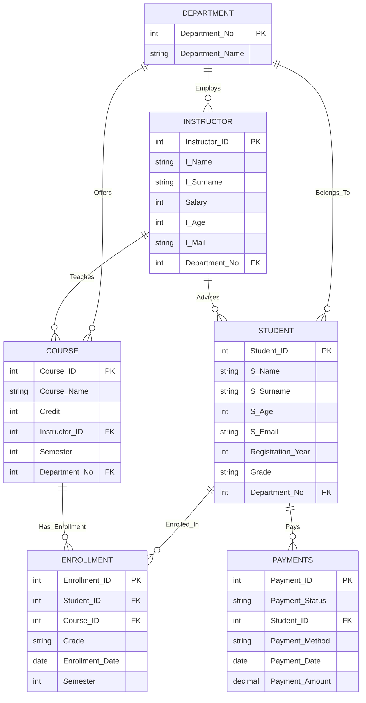

## 1. 📌 Introduction

The system assumes the following:

* Each **student** belongs to exactly one **department**.
* Each **department** can offer multiple **courses**.
* Each **instructor** works for one department and can teach multiple courses.
* Students can enroll in multiple courses.
* Students may have an assigned academic advisor (Instructor).
* Students make payments to the institution.
* All data is stored in a relational model with properly defined **primary keys**, **foreign keys**, **integrity constraints**, and **relationships**.
---

## 2. 📊 ER Diagram (Mermaid)



---

## 3. 🧱 DDL – Data Definition Language (Schema)

### **🟦 3.1 Department Table**

```sql
CREATE TABLE Department (
    Department_No INT PRIMARY KEY,
    Department_Name VARCHAR(100) NOT NULL UNIQUE
);
```

---

### **🟩 3.2 Student Table**

```sql
CREATE TABLE Student (
    Student_ID INT PRIMARY KEY,
    S_Name VARCHAR(100) NOT NULL,
    S_Surname VARCHAR(100) NOT NULL,
    S_Age INT CHECK (S_Age > 15),
    S_Email VARCHAR(150) UNIQUE,
    Registration_Year INT CHECK (Registration_Year >= 2000),
    Grade VARCHAR(5),
    Department_No INT NOT NULL,
    FOREIGN KEY (Department_No) REFERENCES Department(Department_No)
);
```

---

### **🟦 3.3 Instructor Table**

```sql
CREATE TABLE Instructor (
    Instructor_ID INT PRIMARY KEY,
    I_Name VARCHAR(100) NOT NULL,
    I_Surname VARCHAR(100) NOT NULL,
    Salary INT CHECK (Salary >= 0),
    I_Age INT CHECK (I_Age > 20),
    I_Mail VARCHAR(150) UNIQUE,
    Department_No INT NOT NULL,
    FOREIGN KEY (Department_No) REFERENCES Department(Department_No)
);
```

---

### **🟩 3.4 Course Table**

```sql
CREATE TABLE Course (
    Course_ID INT PRIMARY KEY,
    Course_Name VARCHAR(100) NOT NULL,
    Credit INT CHECK (Credit BETWEEN 1 AND 10),
    Instructor_ID INT NOT NULL,
    Semester INT CHECK (Semester BETWEEN 1 AND 8),
    Department_No INT NOT NULL,
    FOREIGN KEY (Instructor_ID) REFERENCES Instructor(Instructor_ID),
    FOREIGN KEY (Department_No) REFERENCES Department(Department_No)
);
```

---

### **🟦 3.5 Enrollment Table**

```sql
CREATE TABLE Enrollment (
    Enrollment_ID INT PRIMARY KEY,
    Student_ID INT NOT NULL,
    Course_ID INT NOT NULL,
    Grade VARCHAR(5),
    Enrollment_Date DATE DEFAULT CURRENT_DATE,
    Semester INT CHECK (Semester BETWEEN 1 AND 8),
    FOREIGN KEY (Student_ID) REFERENCES Student(Student_ID),
    FOREIGN KEY (Course_ID) REFERENCES Course(Course_ID)
);
```

---

### **🟩 3.6 Payments Table**

```sql
CREATE TABLE Payments (
    Payment_ID INT PRIMARY KEY,
    Payment_Status VARCHAR(20) CHECK (Payment_Status IN ('Paid', 'Pending', 'Cancelled')),
    Student_ID INT NOT NULL,
    Payment_Method VARCHAR(50),
    Payment_Date DATE DEFAULT CURRENT_DATE,
    Payment_Amount DECIMAL(10,2) CHECK (Payment_Amount >= 0),
    FOREIGN KEY (Student_ID) REFERENCES Student(Student_ID)
);
```
