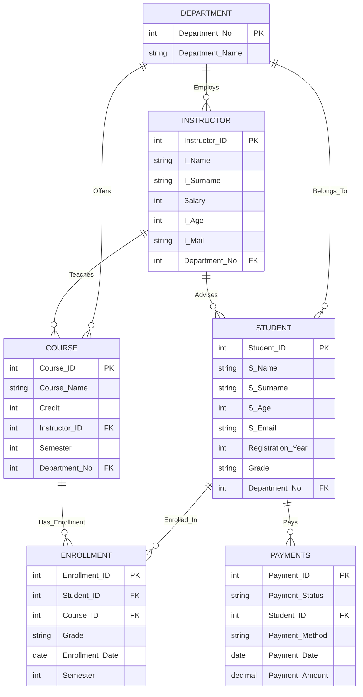

## 1. 📌 Introduction

The system assumes the following:

* Each **student** belongs to exactly one **department**.
* Each **department** can offer multiple **courses**.
* Each **instructor** works for one department and can teach multiple courses.
* Students can enroll in multiple courses.
* Students may have an assigned academic advisor (Instructor).
* Students make payments to the institution.
* All data is stored in a relational model with properly defined **primary keys**, **foreign keys**, **integrity constraints**, and **relationships**.
---

## 2. 📊 ER Diagram (Mermaid)



---

## 3. 🧱 DDL – Data Definition Language (Schema)

### **🟦 3.1 Department Table**

```sql
CREATE TABLE Department (
    Department_No INT PRIMARY KEY,
    Department_Name VARCHAR(100) NOT NULL UNIQUE
);
```

---

### **🟩 3.2 Student Table**

```sql
CREATE TABLE Student (
    Student_ID INT PRIMARY KEY,
    S_Name VARCHAR(100) NOT NULL,
    S_Surname VARCHAR(100) NOT NULL,
    S_Age INT CHECK (S_Age > 15),
    S_Email VARCHAR(150) UNIQUE,
    Registration_Year INT CHECK (Registration_Year >= 2000),
    Grade VARCHAR(5),
    Department_No INT NOT NULL,
    FOREIGN KEY (Department_No) REFERENCES Department(Department_No)
);
```

---

### **🟦 3.3 Instructor Table**

```sql
CREATE TABLE Instructor (
    Instructor_ID INT PRIMARY KEY,
    I_Name VARCHAR(100) NOT NULL,
    I_Surname VARCHAR(100) NOT NULL,
    Salary INT CHECK (Salary >= 0),
    I_Age INT CHECK (I_Age > 20),
    I_Mail VARCHAR(150) UNIQUE,
    Department_No INT NOT NULL,
    FOREIGN KEY (Department_No) REFERENCES Department(Department_No)
);
```

---

### **🟩 3.4 Course Table**

```sql
CREATE TABLE Course (
    Course_ID INT PRIMARY KEY,
    Course_Name VARCHAR(100) NOT NULL,
    Credit INT CHECK (Credit BETWEEN 1 AND 10),
    Instructor_ID INT NOT NULL,
    Semester INT CHECK (Semester BETWEEN 1 AND 8),
    Department_No INT NOT NULL,
    FOREIGN KEY (Instructor_ID) REFERENCES Instructor(Instructor_ID),
    FOREIGN KEY (Department_No) REFERENCES Department(Department_No)
);
```

---

### **🟦 3.5 Enrollment Table**

```sql
CREATE TABLE Enrollment (
    Enrollment_ID INT PRIMARY KEY,
    Student_ID INT NOT NULL,
    Course_ID INT NOT NULL,
    Grade VARCHAR(5),
    Enrollment_Date DATE DEFAULT CURRENT_DATE,
    Semester INT CHECK (Semester BETWEEN 1 AND 8),
    FOREIGN KEY (Student_ID) REFERENCES Student(Student_ID),
    FOREIGN KEY (Course_ID) REFERENCES Course(Course_ID)
);
```

---

### **🟩 3.6 Payments Table**

```sql
CREATE TABLE Payments (
    Payment_ID INT PRIMARY KEY,
    Payment_Status VARCHAR(20) CHECK (Payment_Status IN ('Paid', 'Pending', 'Cancelled')),
    Student_ID INT NOT NULL,
    Payment_Method VARCHAR(50),
    Payment_Date DATE DEFAULT CURRENT_DATE,
    Payment_Amount DECIMAL(10,2) CHECK (Payment_Amount >= 0),
    FOREIGN KEY (Student_ID) REFERENCES Student(Student_ID)
);
```

---

## 📘 **15 Complex SQL Queries (University Database System)**

**(Includes JOINs, Subqueries, Character Functions, Date Functions, Numeric Functions, Aggregations, and Advanced SQL Operations)**

---

### **1. List the Top 5 Courses with the Highest Credits**

```sql
SELECT Course_Name, Credit
FROM Course
ORDER BY Credit DESC
LIMIT 5;
```

---

### **2. Count How Many Courses Each Student Is Enrolled In**

```sql
SELECT s.S_Name, s.S_Surname, COUNT(e.Enrollment_ID) AS Total_Courses
FROM Student s
LEFT JOIN Enrollment e ON s.Student_ID = e.Student_ID
GROUP BY s.Student_ID;
```

---

### **3. Display the Number of Students in Each Department**

```sql
SELECT d.Department_Name, COUNT(s.Student_ID) AS Student_Count
FROM Department d
LEFT JOIN Student s ON d.Department_No = s.Department_No
GROUP BY d.Department_No;
```

---

### **4. Show the Total Payment Amount Made by Each Student**

```sql
SELECT s.S_Name, s.S_Surname, SUM(p.Payment_Amount) AS Total_Paid
FROM Student s
JOIN Payments p ON s.Student_ID = p.Student_ID
GROUP BY s.Student_ID;
```

---

### **5. List Courses with Credit Above the Average Credit Value**

```sql
SELECT Course_Name, Credit
FROM Course
WHERE Credit > (SELECT AVG(Credit) FROM Course);
```

---

### **6. Find the Most Enrolled Course**

```sql
SELECT c.Course_Name, COUNT(e.Enrollment_ID) AS Total_Enrollments
FROM Course c
JOIN Enrollment e ON c.Course_ID = e.Course_ID
GROUP BY c.Course_ID
ORDER BY Total_Enrollments DESC
LIMIT 1;
```

---

### **7. List Payments Made in the Last 30 Days**

```sql
SELECT p.Payment_ID, s.S_Name, s.S_Surname, p.Payment_Date, p.Payment_Amount
FROM Payments p
JOIN Student s ON p.Student_ID = s.Student_ID
WHERE p.Payment_Date >= CURRENT_DATE - INTERVAL '30 days';
```

---

### **8. Calculate the Average Grade for Each Course**

```sql
SELECT c.Course_Name, AVG(NULLIF(TRY_CAST(e.Grade AS INT), 0)) AS Average_Grade
FROM Course c
JOIN Enrollment e ON c.Course_ID = e.Course_ID
GROUP BY c.Course_ID;
```

---

### **9. Find Students Whose Surname Ends with “son” (Character Function)**

```sql
SELECT *
FROM Student
WHERE LOWER(S_Surname) LIKE '%son';
```

---

### **10. Show Total Enrollment Count and Average Semester per Course**

```sql
SELECT c.Course_Name, COUNT(e.Student_ID) AS Student_Count, AVG(e.Semester) AS Avg_Semester
FROM Course c
JOIN Enrollment e ON c.Course_ID = e.Course_ID
GROUP BY c.Course_ID;
```

---

### **11. List Students Who Are Not Enrolled in Any Course (Subquery)**

```sql
SELECT S_Name, S_Surname
FROM Student
WHERE Student_ID NOT IN (SELECT Student_ID FROM Enrollment);
```

---

### **12. Retrieve the Instructor with the Highest Salary**

```sql
SELECT I_Name, I_Surname, Salary
FROM Instructor
ORDER BY Salary DESC
LIMIT 1;
```

---

### **13. Show Average Instructor Salary by Department**

```sql
SELECT d.Department_Name, AVG(i.Salary) AS Average_Salary
FROM Department d
JOIN Instructor i ON d.Department_No = i.Department_No
GROUP BY d.Department_No;
```

---

### **14. Find Students Who Paid More Than 5000 Total (SUM + HAVING)**

```sql
SELECT s.S_Name, s.S_Surname, SUM(p.Payment_Amount) AS Total_Payment
FROM Student s
JOIN Payments p ON s.Student_ID = p.Student_ID
GROUP BY s.Student_ID
HAVING SUM(p.Payment_Amount) > 5000;
```

---

### **15. Display Enrollment Date in a Formatted Style (Date Function)**

```sql
SELECT s.S_Name, s.S_Surname,
       TO_CHAR(e.Enrollment_Date, 'DD Mon YYYY') AS Formatted_Date
FROM Student s
JOIN Enrollment e ON s.Student_ID = e.Student_ID;
```
